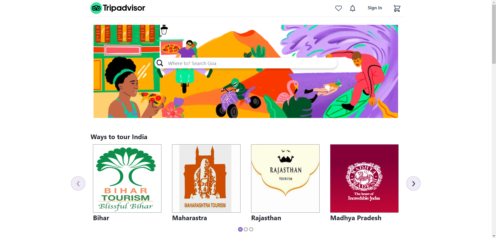
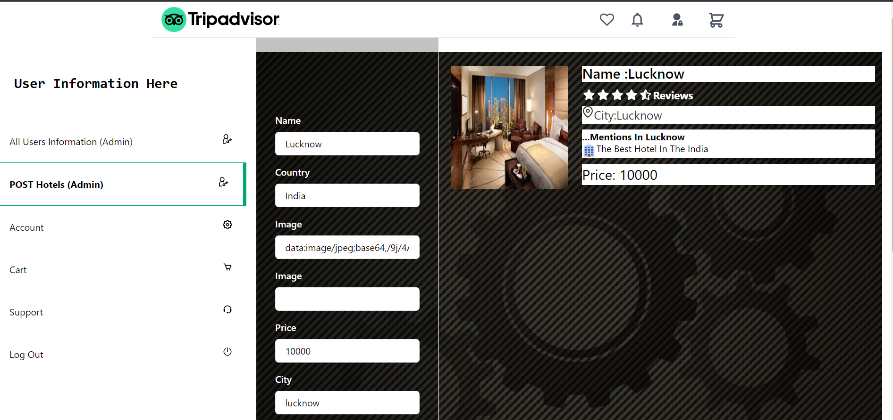
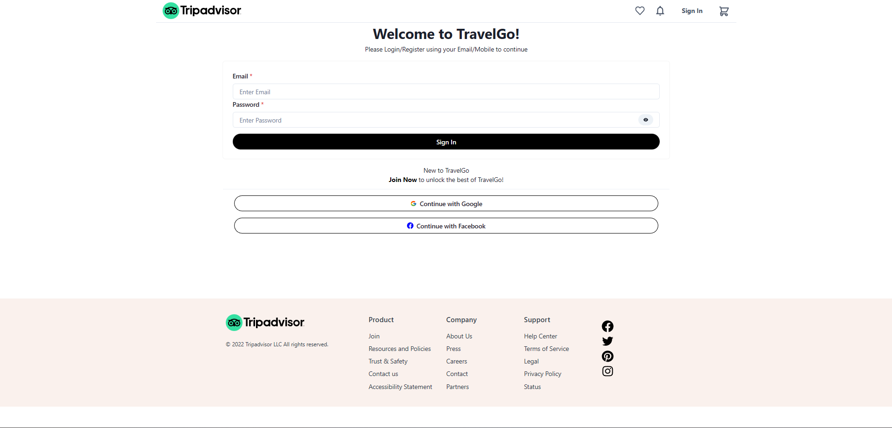
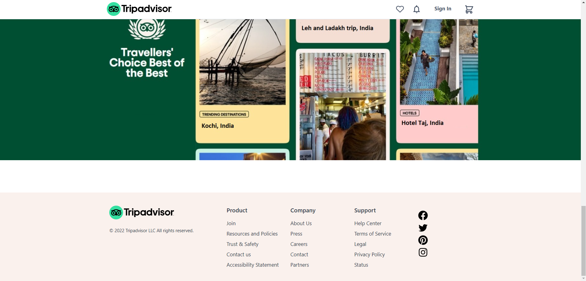

# Tripadvisor - Clone
Tripadvisor is an American online travel company that operates a website and mobile app with user-generated content and a comparison shopping website. It also offers online hotel reservations and bookings for transportation, lodging, travel experiences, and restaurants.Its headquarters are in Needham, Massachusetts.
 
The tripadvisor website has been cloned by myself and my team of 4 members as project of our construct week at **Masai School** over 5 days.

#### Project Code - industrious-steam-9257

## Technology
- **Front-end:** HTML, CSS, JavaScript,ReactJs, Redux, ChakraUi.
- **Back-end:** nodeJs, expressJs, JavaScriptS, MongoDb.
- **Version control:** Git and GitHub.
- **Hosting:** Vercel

## Features
- Multi-level interaction in the sign-up process for users to know their needs and to provide service accordingly
- Transitioning accordions in various positions for various purposes.
- Password strength given by the user is displayed live.
- Sign-in for users.
- Search for hotels
- Make payment
- Book your trip
- Admin dashboard
- Resposive for all type of displays

## Snapshots of the project

1. Landing page and navigation bar

*******************************************************************************

2. Tripadvisor hotels page

*******************************************************************************

3. POST Hotel Dashboard (Only for admin)

*******************************************************************************

4. Signup and sign-in pages

*******************************************************************************

5. Payment Page

*******************************************************************************

6. Admin Dashboard (Only for admin)

*******************************************************************************

7. Footer section

*******************************************************************************

<!--  
## Demo
>Link - [TravelGo](https://tripadvisor-rsoni2843.web.app/)
>Project demonstration link- 
<a href="#">click here</a> -->

## Authors

#### Sushant Kumar
> Github: [Sushant Kumar](https://github.com/sushantkr961)
Team lead, daily POC and worked on landing page, about page, navbar, tourism page, hotel details page

#### Nipendra Soni
>Github: [Nipendra Soni](https://github.com/rsoni2843)
worked on backend, signup, login and cart page

#### Gaurav Kumar
>Github: [Gaurav Kumar](https://github.com/erGaurav13)
worked on hotel list, admin dashboard

#### Ravi Roshan
>Github: [Ravi Roshan](https://github.com/Ravi98351)
worked on payment page and user details page

## Run on your Machine
1. cd Frontend
2. npm install
3. npm start

### Login as an admin 
- email:- sushantonly961@gmail.com
- password:- 1234

